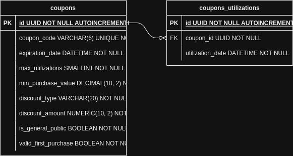

# Discountify - Spotlar Code Challenge 

Olá, boas vindas ao serviço **Discountify**, um microserviço de cupons de desconto.

O objetivo desse serviço é criar uma API REST com dois endpoints. Um endpoint para cadastro de cupons de desconto e um endpoint para consumo dos cupons de desconto.

Para saber mais sobre os endpoints, acesse a seção de [**Documentação da API**](#documentação-da-api).


## Rodando o projeto localmente

Requisitos para rodar o projeto:

- Esse serviço foi feito utilizando o **Python 3.11**
- É extremamente recomendado que ele seja rodado em um ambiente Linux, ou dentro do WSL com Ubuntu no caso do Windows
- Para rodar o projeto, será utilizando o **Docker**, para isolar todas as dependências do projeto em containers, junto com o **Docker Desktop** e o **Docker Compose** na sua **V2**, por isso será necessário que eles estejam instalados na sua máquina
- Também será necessário ter o Git instalado na sua máquina para fazer a clonagem do repositório

### Clone o repositório para a sua máquina

1. Clone o repositório para a sua máquina com o comando `git clone git@github.com:willy-r/discountify-code-challenge.git`
2. Mude para o **diretório raíz** do projeto com o comando `cd discountify-code-challenge`
3. Todos os comandos citados aqui serão executados dentro desse diretório

### Rodando com Docker

> Para rodar com o Docker, essa aplicação faz uso de [**scripts**](./scripts/) para facilitar e agilizar o processo de desenvolvimento

1. Será necessário executar o script [**run.sh**](./scripts/run.sh) para rodar o projeto:
    ```bash
    sh ./scripts/run.sh
    ```
    Esse script irá subir e buildar os containers necessários para o funcionamento da aplicação, tais como: o container da **FastAPI**, do banco de dados (nesse caso o **PostgreSQL**) e um container para gerenciar e visualizar os dados do banco de dados usando o **DB Adminer**.

2. Como a aplicação utiliza o **Alembic** para o gerenciamento de migrações do banco de dados, também será necessário executar o script [**migrate.sh**](./scripts/migrate.sh) para a criação das tabelas necessárias para o funcionamento adequado da aplicação.
    ```bash
    sh ./scripts/migrate.sh
    ```

3. Após isso, a aplicação estará pronta para uso em [localhost:8000/docs](http://localhost:8000/docs)

4. Para parar os containers, basta apenas executar o script [**stop.sh**](./scripts/stop.sh):
    ```bash
    sh ./scripts/stop.sh
    ```
    Todos os containers serão parados e removidos.

### Testes da aplicação

- Para rodar os **testes** basta apenas executar o script [**test.sh**](./scripts/test.sh), isso irá rodar os testes dentro do container, porém será possível ver seus resultados em tempo real no terminal
    ```bash
    sh ./scripts/test.sh
    ```


## Modelagem dos dados

Seguindo o que foi especificado para a construção do microserviço e após um tempo de análise, cheguei ao seguinte modelo de dados:



Nesse simples Diagrama ER, eu possuo todas as informações necessárias para o cupom de desconto na tabela **coupons** e crio um relacionamento de **1 para muitos** com a tabela **coupons_utilizations** tabela para salvar as utilizações de cada cupom junto com a data de utilização.


## Documentação da API

> Você poderá acessar uma documentação interativa do **Swagger** em [localhost:8000/docs](http://localhost:8000/docs) após executar a aplicação seguindo os passos em [**Rodando o projeto localmente**](#rodando-o-projeto-localmente)

Para essa REST API, temos dois importantes endpoints:

1. Um endpoint para cadastro de cupons de desconto
2. Um endpoint para consumo dos cupons de desconto

### Cadastro de cupons de desconto

`POST /coupons`

Nessa rota você deverá fornecer as informações necessárias para o cadastro de um cupom de desconto seguindo as seguintes regras:

- Não poderá haver código de cupom de desconto repetido, ele deve ser único. Se isso ocorrer, um erro **409 Conflict** será retornado.
- Existem 3 tipos de desconto: `percentage`, `fixed_general_public` e `fixed_first_purchase`. Se um inválido for passado, um erro **422 Unprocessable Entity** será retornado.
    - O tipo `percentage` significa percentual de desconto aplicado ao valor total.
    - O tipo `fixed_general_public` significa valor fixo do desconto para o público geral.
    - O tipo `fixed_first_purchase` significa valor fixo para primeira compra do cliente no site.

**Exemplo de requisição JSON**
```json
{
  "coupon_code": "ABC123",
  "expiration_date": "2023-07-19 15:00:00", // Use o horário padrão de Brasília.
  "max_utilizations": 100,
  "min_purchase_value": 100,
  "discount_type": "percentage",
  "discount_amount": 30,
  "is_general_public": true,
  "valid_first_purchase": false
}
```

**Exemplo de resposta JSON**
```json
{
  "coupon_code": "ABC123",
  "expiration_date": "2023-07-19T15:00:00",
  "max_utilizations": 100,
  "min_purchase_value": 100,
  "discount_type": "percentage",
  "discount_amount": 30,
  "is_general_public": true,
  "valid_first_purchase": false,
  "id": "62ca6502-83b6-484d-866b-9d0a5962d1a6"
}
```

### Consumo dos cupons de desconto

`POST /coupons/consume`

Nessa rota você deverá fornecer as informações necessárias para o consumo de um cupom de desconto existente seguindo as seguintes regras:

- A data de utilização (o momento da requisição para a rota) deve ser inferior à data de expiração do cupom de desconto.
- O número de utilizações do cupom deve ser menor que o número máximo de utilizações do mesmo.
- O valor total da compra deve ser menor que o valor mínimo para utilização do cupom.
- Para o caso do tipo do cupom ser `fixed_first_purchase`, o consumo só será válido para clientes que estiverem fazendo sua primeira compra no site.

> As regras gerais acima geram um erro **400 Bad Request** para o usuário caso sejam descumpridas.


**Exemplo de requisição JSON para o cupom `ABC123`**
```json
{
  "coupon_code": "ABC123",
  "total_purchase_value": 90,
  "is_first_purchase": false
}
```

**Exemplo de resposta JSON para o cupom `ABC123`**
```json
{
  "discount_value": 62.99999999999999,
  "coupon_code": "ABC123"
}
```


## Autor

- [William Rodrigues](https://www.linkedin.com/in/william-rodrigues-dev/)
